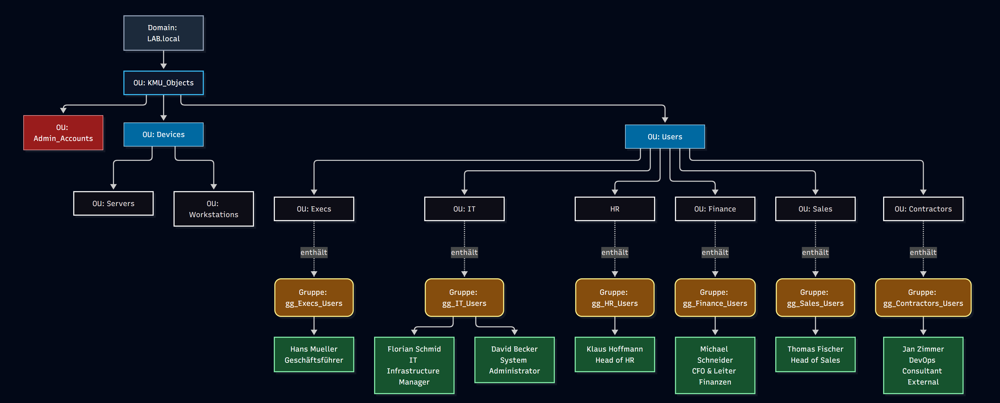
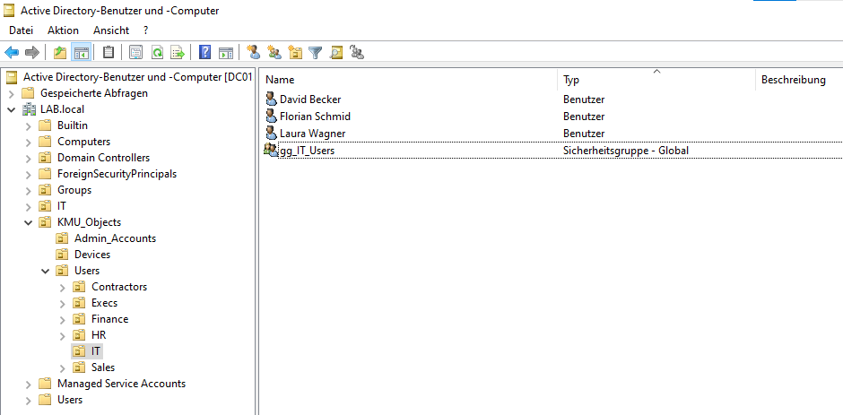
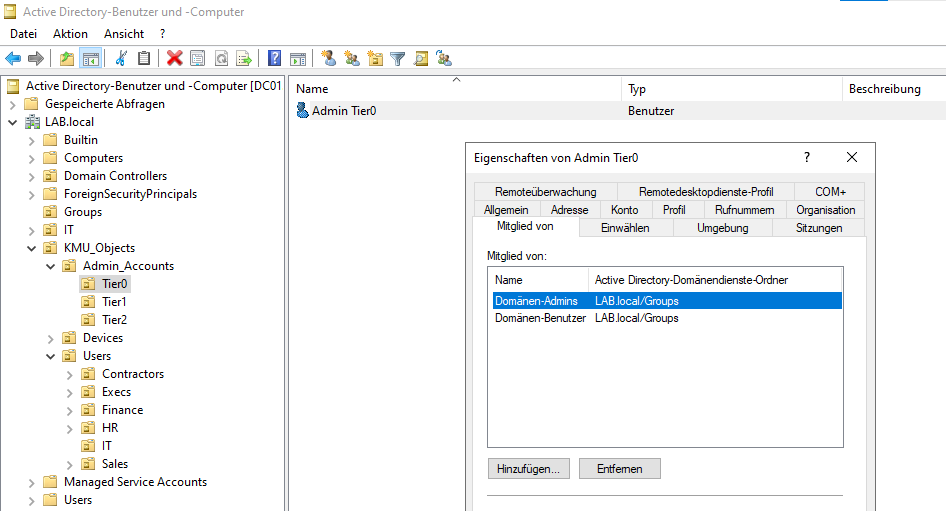
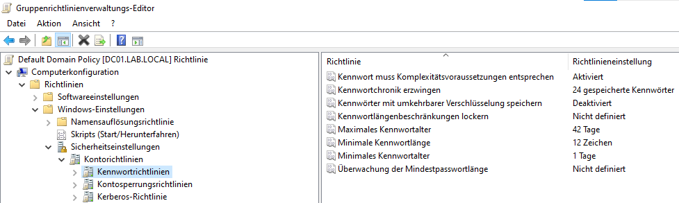
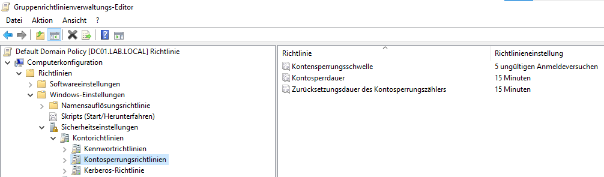
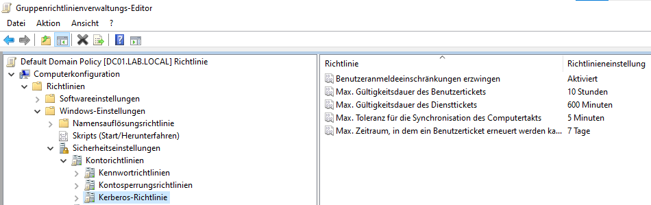
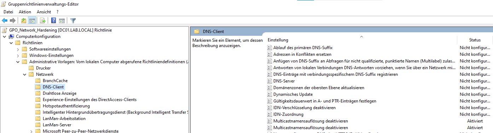
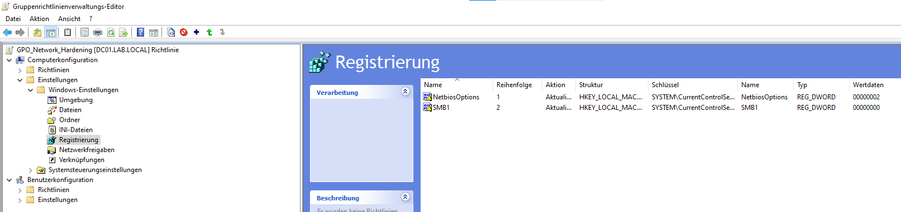

# KMU Active Directory Lab (Windows Server 2022)


### Active Directory Topologie & Identitäten-Hierarchie


Simulation einer sicheren, gehärteten Microsoft Active Directory-Infrastruktur für ein virtuelles KMU (15+ Mitarbeiter) zur Demonstration von On-Premises-Systemadministration, GPO-Governance und Security-Hardening.



*Visualisierung der OU-Struktur, der zugewiesenen AGDLP-Sicherheitsgruppen sowie exemplarischer User.*


## Umgebungsübersicht

- **Domäne:** `LAB.local`
- **Domain Controller:** `DC01` (10.0.2.15) unter Windows Server 2022
- **Mitglieds-Client:** `CLI01` unter Windows 11 Enterprise
- **Netzwerk-Isolierung:** Isoliertes VirtualBox NAT-Netzwerk (`10.0.2.0/24`) ohne externe DNS-Weiterleitungen
- **Verwaltungsmodell:** AGDLP-Prinzip mit vorbereiteter Struktur für gestaffelte Administration


## OU-Struktur & Unternehmensaufbau
Die Active Directory-Topologie bildet ein klassisches KMU ab und ist unterhalb der Haupt-OU `KMU_Objects` zur einfachen Verwaltung und Härtung in drei Kernbereiche unterteilt:

**Admin Accounts:** Isoliert privilegierte Konten als Vorbereitung für ein Tiered Administration Model.

**Devices:** Getrennt nach Servers und Workstations für zielgerichtete Gruppenrichtlinien (GPOs).

**Users:** Nach Fachbereichen strukturiert (Execs, IT, HR, Finance, Sales, Contractors).

Diese Aufteilung ermöglicht die automatisierte Rechtevergabe nach dem AGDLP-Prinzip (z. B. gg_IT_Users). Für externe `Contractors` wird zudem ein automatisches Ablaufdatum erzwungen, um Sicherheitsrisiken durch verwaiste Zugänge zu vermeiden.




## Automatisierung & Skript-Deployment

Alle OUs, globalen Sicherheitsgruppen für die Abteilungen und Benutzerkonten wurden mithilfe von PowerShell-Skripten und einer strukturierten CSV-Datei vollautomatisch angelegt. Die jeweiligen Skripte sind im Ordner `\scripts` hinterlegt.

*Hinweis: Dieses Lab wurde eigenständig geplant, aufgebaut und getestet. Zur Effizienzsteigerung wurden jedoch bei der Skripterstellung KI-Tools (Gemini & Claude) als Copilot für die nachfolgenden Skripte genutzt.*

### 1. Erzeugung der Testdaten
- [\scripts\00-Create-KMU-Users.ps1](scripts/00-Create-KMU-Users.ps1)
- Generiert automatisiert die Quelldatei `kmu_users.csv`.
- Legt 17 Test-Mitarbeiter mit Vor-/Nachnamen, Abteilungen, Rollen, Vorgesetzten und Ablaufdaten für externe Contractors fest.

### 2. Erstellung der OU- & Gruppenstruktur
- [\scripts\01-Create-OUs.ps1](`scripts/01-Create-OUs.ps1`)
- Erstellt die Haupt-OU `KMU_Objects` sowie alle benötigten Unter-OUs.
- Aktiviert den Schutz vor versehentlicher Löschung (`-ProtectedFromAccidentalDeletion $true`).
- Erstellt automatisch globale Abteilungsgruppen (z. B. `gg_IT_Users`, `gg_HR_Users`) nach der **AGDLP**-Namenskonvention.

### 3. Automatisierter Benutzer-Import
- [\scripts\02-Import-Users.ps1](`scripts/02-Import-Users.ps1`)
- Liest alle Benutzerattribute aus `scripts/kmu_users.csv` ein.
- Generiert standardisierte Anmeldenamen (`hmueller`, `fschmid`) inklusive Ersetzung deutscher Umlaute.
- Setzt Initialpasswörter, fordert eine Passwortänderung bei der ersten Anmeldung und weist Benutzer direkt ihren Gruppen zu.
- Steuert den Lebenszyklus externer Dienstleister (Contractors) durch automatisches Setzen von Konto-Ablaufdaten.


## Sicherheits-Härtung & Gruppenrichtlinien (GPO)

Die Sicherheitseinstellungen der Domäne basieren auf Microsoft Security Best Practices:

### 1. **Tiered Administration:**
Unterhalb von `Admin_Accounts` wurden dedizierte administrative Verwaltungsebenen angelegt (`Tier0`, `Tier1`, `Tier2`), um administrative Privilegien strikt zu isolieren:

- **Dual-Account-Strategie:** Reguläre Alltags-Accounts (z. B. `fschmid` in `Users/IT`) werden ausschließlich für E-Mail, Dokumente und Standardaufgaben genutzt und besitzen **keine** administrativen Rechte.
- **Dedizierte Admin-Identitäten:** Für administrative Tätigkeiten existieren getrennte Konten auf den jeweiligen Tiers. 
- **Sicherheitsbegründung:** Diese Trennung verhindert, dass bei einer Kompromittierung eines Alltags-Accounts  Administrationsrechte offengelegt werden.





### 2. Gehärtete Default Domain Policy
Über die `Default Domain Policy` sind folgende Security Baselines domänenweit erzwungen:

#### **Kennwortrichtlinien:**
   - **Komplexität:** Aktiviert (erzwingt Kombination aus Groß-/Kleinbuchstaben, Zahlen und Sonderzeichen).
  - **Mindestlänge:** Erhöht auf 10 Zeichen (gemäß Enterprise Best Practice).
  - **Kennwortchronik:** Speicherung der letzten 24 Passwörter zur Verhinderung von Passwort-Wiederverwendung.



#### **Kontosperrungsrichtlinien:**
   - **Kontosperrungsschwelle:** Automatische Sperrung nach 5 fehlerhaften Anmeldeversuchen (Schutz vor Brute-Force-Angriffen).
  - **Sperr- & Rücksetzdauer:** Auf 15 Minuten festgelegt.




#### **Kerberos-Richtlinien:**
- **Ticket-Lebensdauer:** Maximale Gültigkeit von Kerberos-TGTs (Ticket Granting Tickets) auf 10 Stunden begrenzt.




### 3. Netzwerk-Härtung & Protokoll-Absicherung

Diese Maßnahme dient der Abwehr von Man-in-the-Middle-Angriffen (wie *Responder* / Credential Poisoning) und zur Deaktivierung veralteter, anfälliger Schnittstellen. Dafür wurden folgende Richtlinien domänenweit erzwungen:

- **LLMNR (Link-Local Multicast Name Resolution) & mDNS:** Vollständig deaktiviert (`DNS-Client -> Multicastnamensauflösung deaktivieren`), um das Abfangen von Authentifizierungs-Anfragen im lokalen Netzwerk zu unterbinden.




- **NBT-NS:** Zentral per Registrierungs-GPO deaktiviert (`NetbiosOptions = 2`), um unverschlüsselte Broadcast-Namensauflösungen zu verhindern.
- **SMBv1-Protokoll:** Deaktivierung des veralteten SMBv1-Server-Dienstes per Registry-Key (`SMB1 = 0`), um Risiken durch bekannte Ransomware-Vektoren (z. B. EternalBlue) zu eliminieren.




### 3. **Ausblick / Next Steps:**
- Implementierung von Windows LAPS (Local Administrator Password Solution)
- Zuordnung dedizierter Tier-Admins inkl. Authentication Policies & User Rights Assignment GPOs.


## Repository-Struktur

```text
Enterprise-AD-HomeLab/
├── README.md
├── LICENSE
├── scripts/
│   ├── 00-Generate-UsersCSV.ps1
│   ├── 01-Create-OUs.ps1
│   ├── 02-Import-Users.ps1
│   └── kmu_users.csv
└── screenshots/
    ├── 01-aduc-structure.png
    ├── 02-gpo-overview.png
    └── 03-laps-functional.png
